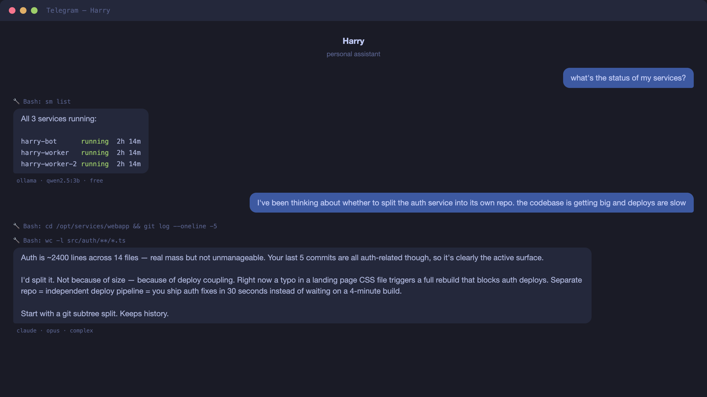

# harry-bot

> Personal AI assistant on Telegram with persistent memory, multi-model routing, and a soul. Named after Harry Potter.

<p align="center">
	
</p>

Harry isn't a fresh LLM session every time. He reads your vault of notes, journals, and memories, tracks conversation history, and uses that context to be genuinely helpful. Shell access to your server, email, calendar, and proactive morning briefings and evening check-ins.

## Features

- **Soul system** — personality defined in markdown, not Python. Edit who Harry is without touching code.
- **Multi-model routing** — deterministic complexity classifier routes to the cheapest capable model. Acks → Ollama (free), questions → Sonnet, reasoning → Opus.
- **Dream consolidation** — every 4 hours, Haiku extracts atomic facts from conversations into persistent memory.
- **Agent-agnostic** — Claude, Ollama, Gemini, Codex, OpenCode all swappable per-message.
- **Integration manifests** — plugin system for external services at ~90 tokens per integration vs ~2000 for MCP.
- **Skills** — markdown files with YAML frontmatter become `/slash_commands` on Telegram. No code needed.
- **Direct commands** — skill+args combos that map to shell commands, bypassing the LLM entirely. Zero tokens.

## Getting started

```sh
git clone https://github.com/saadnvd1/harry-bot.git
cd harry-bot
python3 setup.py
./start.sh
```

That's it. The setup wizard handles everything:

1. **Checks prerequisites** — Python 3.11+, Claude CLI, pip
2. **Installs dependencies** — creates venv, installs packages
3. **Configures Telegram** — walks you through creating a bot with @BotFather and getting your user ID
4. **Creates your vault** — where Harry stores memories, conversations, and context
5. **Builds your profile** — asks about you so Harry can personalize from day one
6. **Optional integrations** — Gmail, Gemini (skip any you don't need)

Then `./start.sh` runs everything in one process. `Ctrl+C` stops it.

### Prerequisites

- Python 3.11–3.13 (setup auto-detects the right version via pyenv/homebrew; 3.14+ not yet supported)
- [Claude Code CLI](https://docs.anthropic.com/en/docs/claude-code) — `claude` command available in PATH
- A Telegram account

### Running in production

For parallel workers (handles multiple messages at once):

```sh
./start.sh --workers 2
```

For always-on deployment, use [serviceman](https://github.com/saadnvd1/serviceman) or systemd:

```sh
sm add harry-bot "python3 bot.py" -c /path/to/harry-bot
sm add harry-worker "python3 -m worker.main" -c /path/to/harry-bot
sm start harry-bot harry-worker
```

### Manual setup

If you prefer to skip the wizard:

```sh
python3 -m venv venv && source venv/bin/activate
pip install -r requirements.txt
cp .env.example .env
# Edit .env — see .env.example for all options
mkdir -p vault/{harry-memory,conversations,about,journal}
```

## Architecture

```
┌─────────────┐     SQLite queue      ┌──────────────┐
│  harry-bot  │ ──── (WAL mode) ────▶ │ harry-worker │
│  (Telegram  │     honker notify     │  (Claude CLI │
│   poller)   │                       │   + agents)  │
└─────────────┘                       └──────────────┘
                                             │
                                      ┌──────┴──────┐
                                      │    Agents    │
                                      ├─────────────┤
                                      │ Claude      │
                                      │ Ollama      │
                                      │ Gemini      │
                                      │ Codex       │
                                      │ OpenCode    │
                                      └─────────────┘
```

**harry-bot** — thin Telegram poller. Routes script shortcuts inline, enqueues everything else.

**harry-worker** — queue consumer. Enriches context, picks an agent, streams responses back to Telegram with tool calls rendered inline.

## Multi-model routing

| Complexity | Examples | Agent | Model | Cost |
|-----------|----------|-------|-------|------|
| simple | "ok", "thanks", "5+3" | ollama | qwen2.5:3b | free |
| simple/ack | "yes", "got it" | gemini | flash | free |
| medium | questions, requests | claude | sonnet | $3/$15 per MTok |
| complex | architecture, planning | claude | opus | $15/$75 per MTok |

Under 70% API usage, Opus handles everything. Over 70%, tiered routing conserves quota.

Override per-message: `!h` (haiku), `!s` (sonnet), `!opus`, `!ollama`, `!codex`, `!opencode`.

## Customization

### Soul files

Edit markdown in `soul/` to define Harry's personality:

| File | Purpose |
|------|---------|
| `SOUL.md` | Personality, voice, anti-patterns |
| `USER.md` | Who you are, trust boundaries |
| `AGENTS.md` | Execution rules, reference paths |
| `TOOLS.md` | Available tools, runtime environment |

### Skills

Drop a markdown file in `skills/`:

```markdown
---
command: weather
description: Get weather for a city
agent: ollama
---
Get the current weather for {args}.
Run: `curl -s 'wttr.in/{args}?format=3'`
```

Auto-registered as `/weather` on Telegram at startup.

### Integrations

Add a directory in `integrations/` with a `manifest.json`:

```json
{
  "name": "myservice",
  "type": "python-tool",
  "entry": "integrations.myservice.cli",
  "env_required": ["MYSERVICE_API_KEY"],
  "prompt_doc": "MyService via `python3 integrations/myservice/cli.py <cmd>`."
}
```

Missing env vars = silently excluded. Zero token cost when unconfigured.

## Two-repo setup

Keep the engine public and your personal config private:

```
harry-bot/          # this repo — the engine
harry-private/      # your private repo
  soul/             # your personality files
  skills/           # your custom skills
  personas/         # expert modes
  context/          # reference docs
  shortcuts.json    # personal script shortcuts
```

Point `HARRY_DATA_DIR` to your private repo:

```sh
export HARRY_DATA_DIR=/path/to/harry-private
```

When unset, falls back to the project root where example files live.

## Project structure

```
harry-bot/
├── bot.py              # Entry point, Telegram polling
├── config.py           # All configuration (env vars)
├── agents/             # LLM adapters (Claude, Ollama, Gemini, Codex, OpenCode)
├── brain/              # Routing, prompts, context, memory, dream, costs
├── channels/           # Telegram renderer (streaming, tool calls)
├── handlers/           # Telegram command/message handlers
├── integrations/       # Plugin system for external services
├── worker/             # Async job queue + runner
├── tools/              # Standalone CLIs (gratitude, calendar, etc.)
├── soul/               # Personality files (markdown)
├── skills/             # Slash command templates (markdown)
├── context/            # Reference docs for dream/enrichment
└── examples/           # Annotated example configs
```

## FAQ

#### Why Claude Code CLI instead of the API?

No API key needed — runs on a Claude Max subscription. `claude --print` with `--output-format stream-json` gives full tool call visibility for the same price you're already paying.

#### Why SQLite instead of Redis/RabbitMQ?

One less dependency. WAL mode handles concurrent bot+worker access. Honker (WAL-based NOTIFY/LISTEN) gives ~1ms wake latency without polling.

#### Why not MCP for integrations?

Token cost. Each MCP server injects ~2000 tokens of tool schemas per turn per provider. The manifest pattern adds a one-line `prompt_doc` (~90 tokens) and lets Claude call the CLI via Bash. Same capability, 20x fewer tokens.

## Related

- [serviceman](https://github.com/saadnvd1/serviceman) - Process manager used to run harry-bot services

## License

MIT
